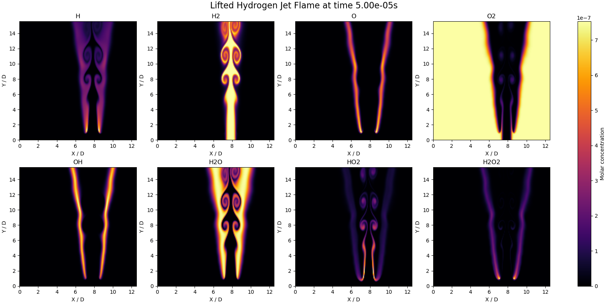
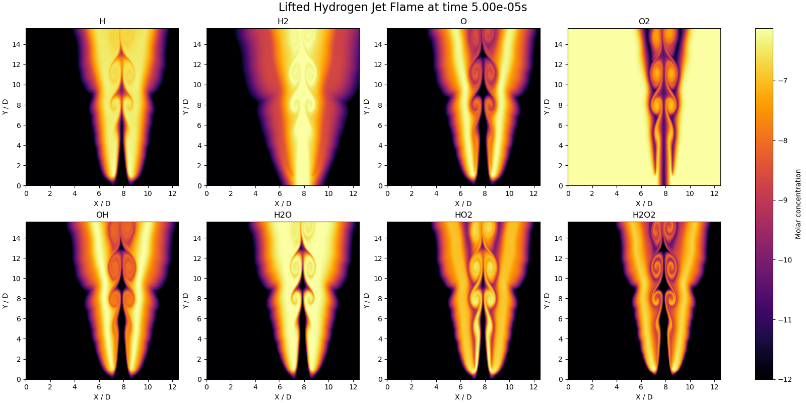
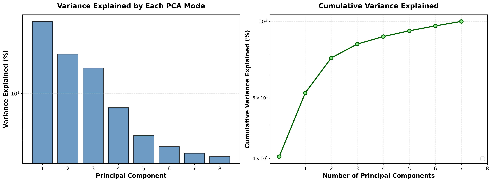
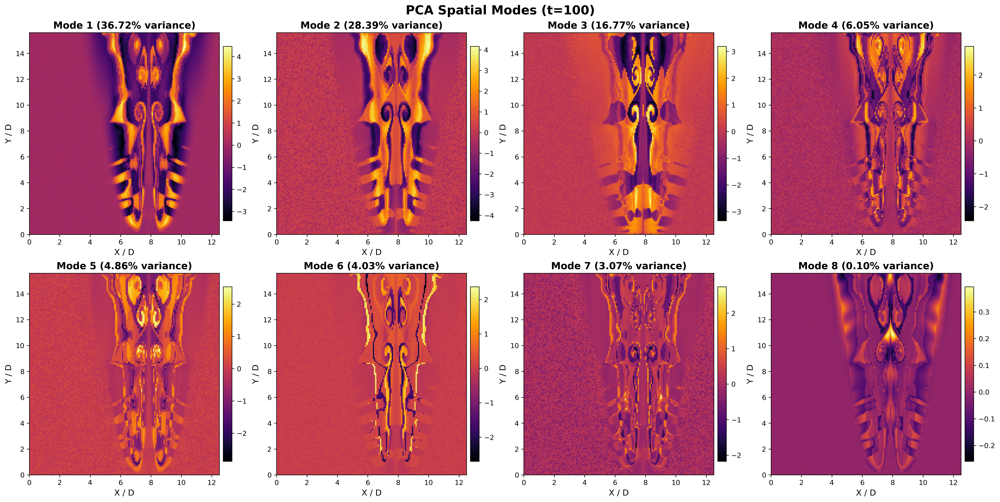
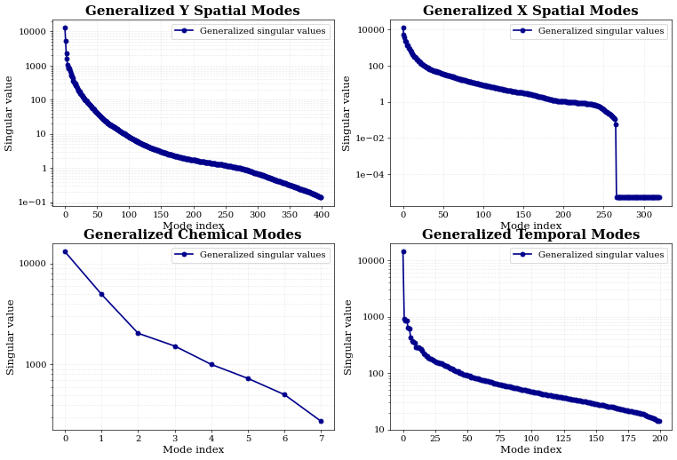
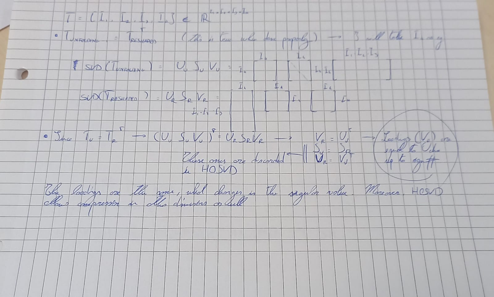

# Higher-Order Singular Value Decomposition for Hydrogen Jet Combustion Analysis

## Overview

The focus of the work is now comparing HOSVD to PCA in combustion. The methodology decomposes multi-dimensional combustion data into orthogonal modes that capture spatial patterns, temporal evolution, and chemical species interactions. Briefly, the following steps have to be followed (checklist):
1.  Dowload a suitable dataset, possibly a DNS of hydrogen combustion (done)
2.  Define a preprocessing pipeline justitying all the choices made (almost done)
3.  Perform classical PCA on the reshaped tensor (x * y * time, number of chemical species) (almost done)
4.  Check the results of classical PCA with Parente 
5.  Perform HOSVD and if necessary HOOI (HOPCA) (done)
6.  Check the results of HOSVD (HOOI/HOPCA) (done)
7.  Compare the results quantitatively -> reconstruction errors
8.  Compare the resutls qualitatively -> do the PC mean something in both cases? (almost done)
9.  Draw some conclusions
10. Run everything for real on CESVIMA
11. Write the paper (this needs to be done while the code runs)

## 1. Data Acquisition
Data is taken from BLASTNET at the following link:
https://blastnet.github.io/diluted_partially_premixed_h2air_lifted_flame

This is a Direct Numerical Simulation (DNS) data of hydrogen jet under multiple conditions, the ones currently analyzed are:

Each simulation provides:
- Spatial resolution: 1600 × 2000 grid points
- Temporal snapshots: 200 time steps
- Chemical species: 8 tracked species (H, H₂, O, O₂, OH, H₂O, HO₂, H₂O₂)



## 2. Data Preprocessing

### Spatial Subsampling
In order to have the code run fast and test without losing too much time transfering everything on CESVIMA, the data is reduced heavily.

- Original grid: 1600 × 2000 points
- Subsampled grid: 200 × 160 points (10× reduction in each direction)

### Mass to Molar Fraction Conversion

Mass fractions are converted to molar fractions by dividing by species-specific molar masses, I wanna whatch the chemistry process, so I want moles. If I keep mass concentration the prevalent modes are not the species which are most involved in chemical reactions, but the heavier ones (learned this at my own expense :( )


### Data Processing

For the moment the only processing that I am making is logarithmic scaling to make sure that all variables are more on less on the same order of magnitude. I am not fully convinced about centering, usually PCA requires it, but I am working with quantities in the same domain and I don't want negative concentrations or masses (although in the log domain might be a good idea). 

This stuff is really important because the results are higly dependent on it. For the moment:
- log10 scale (ONLY!)




## 3. Classical PCA Analysis

### Methodology

Classical Principal Component Analysis (PCA) is performed by reshaping the 4D tensor (x, y, species, time) into a 2D matrix of shape (x·y·time, species). This treats each spatial-temporal point as an independent observation and identifies the linear combinations of chemical species that capture the most variance in the data.

The preprocessing applied before PCA includes:
- Log₁₀ scaling to handle the large dynamic range of species concentrations
- Epsilon floor of 1e-12 to avoid logarithm singularities

Singular Value Decomposition (SVD) is used to compute the principal components:
```
X = U Σ Vᵀ
```
where:
- **U** contains the spatial-temporal patterns (Φ, spatial modes)
- **Σ** contains the singular values (related to variance explained)
- **V** contains the loadings (contribution of each species to each mode)

### Species Contributions to Principal Components

| Mode | 1st Species | 2nd Species | 3rd Species | 4th Species | 5th Species | 6th Species | 7th Species | 8th Species |
|------|-------------|-------------|-------------|-------------|-------------|-------------|-------------|-------------|
| 1 | YH₂O₂ (12.5%) | YHO₂ (12.5%) | YH₂O (12.5%) | YOH (12.5%) | YO₂ (12.5%) | YO (12.5%) | YH₂ (12.5%) | YH (12.5%) |
| 2 | YH₂O (17.7%) | YO (17.6%) | YH₂ (17.2%) | YHO₂ (17.2%) | YH₂O₂ (7.7%) | YH (7.7%) | YO₂ (7.4%) | YOH (7.4%) |
| 3 | YOH (18.5%) | YO₂ (18.4%) | YH (16.2%) | YH₂O₂ (16.2%) | YHO₂ (8.8%) | YH₂ (8.8%) | YH₂O (6.6%) | YO (6.6%) |
| 4 | YH₂O₂ (22.5%) | YH (22.4%) | YH₂O (12.3%) | YO (12.2%) | YO₂ (9.0%) | YOH (8.9%) | YH₂ (6.4%) | YHO₂ (6.4%) |
| 5 | YO (14.5%) | YH₂O (14.3%) | YH (13.3%) | YH₂O₂ (13.2%) | YO₂ (11.8%) | YOH (11.7%) | YHO₂ (10.6%) | YH₂ (10.5%) |
| 6 | YH₂ (17.2%) | YHO₂ (16.7%) | YOH (15.7%) | YO₂ (15.5%) | YH (13.4%) | YH₂O₂ (13.2%) | YO (4.4%) | YH₂O (3.9%) |
| 7 | YHO₂ (18.4%) | YH₂ (18.3%) | YO (16.4%) | YH₂O (15.9%) | YH₂O₂ (9.0%) | YH (8.8%) | YO₂ (7.2%) | YOH (6.1%) |
| 8 | YOH (19.3%) | YO₂ (19.0%) | YH₂O (16.7%) | YO (15.9%) | YHO₂ (10.7%) | YH₂ (10.0%) | YH₂O₂ (4.3%) | YH (4.1%) |

### Variance Explained

The variance captured by the principal components quantifies how much information each mode contains (non bene!):




### Spatial Patterns



### 4. Check with PARENTE

Ah beh per questo bisogna che o aspetti o organizzi un meeting

## 5. HOSVD (Higher-Order Singular Value Decomposition)

### Methodology

Unlike classical PCA which reshapes the tensor into a 2D matrix, HOSVD preserves the multi-dimensional structure of the combustion data. The 4D tensor (x, y, species, time) is decomposed using Tucker decomposition:

```
X ≈ G ×₁ U₁ ×₂ U₂ ×₃ U₃ ×₄ U₄
```

where:
- **G** is the core tensor containing the interaction between all modes
- **U₁, U₂** are the spatial factor matrices (x and y dimensions)
- **U₃** is the chemical species factor matrix (U_chem in code)
- **U₄** is the temporal factor matrix (U_time)

The decomposition is computed by:
1. Performing SVD on each mode unfolding of the tensor
2. Computing the core tensor via multi-mode dot product (tensorly)
3. The core tensor G captures the interactions between spatial patterns, chemical species, and temporal evolution

### Reconstruction Accuracy

The HOSVD decomposition achieves excellent reconstruction accuracy:
- **Relative reconstruction error**: 2.00e-15 (stability)

### Core Tensor Singular Values

The core tensor singular values reveal the importance of each mode across different dimensions:


**CORE ** HOSVD core tensor singular values across spatial, chemical, and temporal modes.

- **Spatial Dimensions (X and Y)**: Show rapid decay, indicating that spatial patterns can be captured with relatively few modes
- **Chemical Dimension**: This is the term of comparison (qua c'e' la ciccia, ma e' tardi e lo faccio domani)
- **Time Dimension**: Shows distinct temporal mode importance, with the first few modes capturing most of the temporal dynamics


## (8.) Visual comparison between modes

Although this point is not in exaclty rigorous yet, I think it is worth putting here to maybe get some feedback (speram). Although as per the above picture the information contained in the PCs is more than the one contained in the chemical modes of HOSVD, the HOSVD actually rapresent chemical species. PCs are just ficticious artifacts for compression, whereas HOSVD are interpretable and rooted in physical and chemical variation in modes.


The PCA modes do not retain any spatial or temporal coherence. HOSVD on the other hand recovers structures which spatial and temporal modes are fully intact due to the fact that the truncation is performed only in chemical species

# ISSUE

I have encountered some issues along the way, I am working on solving all of them in order. Some of them were "mistakes" on my part, other were delays due to numerical implementations of numpy reshape. I have finished the proof of the equivalence of HOSVD and PCA (i.e. PCA loadings (V) = U_chem, when unfolding and reshape done properly). Proof is almost trivial, I think I will write it after lunch properly (for now I will upload the photo).

The above plot in which I was comparing hosvd and pca is fundamentally WRONG. I am plotting PCA modes and HOSVD reconstruction, so of course reconstructions look physical. It was too good to be true :(
# Proof of equivalence in PC loadings between PCA and HOSVD

