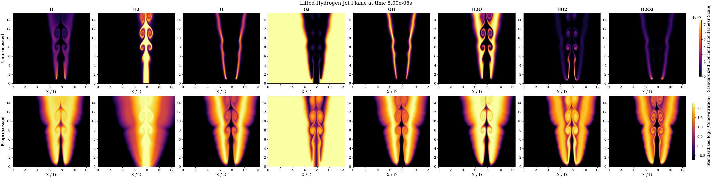
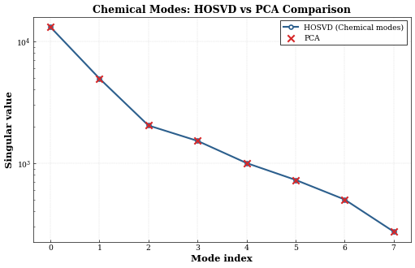
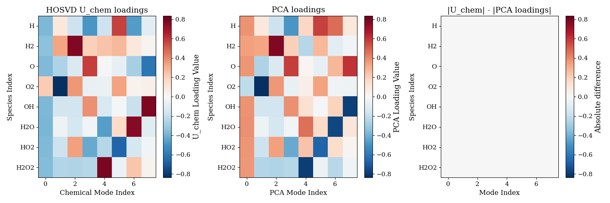

# Higher-Order Singular Value Decomposition for Hydrogen Jet Combustion Analysis

## Overview

The focus of the work is now comparing HOSVD to PCA in combustion. Tensorial methods  decomposes multi-dimensional combustion data into orthogonal modes that capture spatial patterns, temporal evolution, and chemical species interactions, whereas traditional PCA con only focus on a specific dimension. 

## 1. Data Acquisition
Data is taken from BLASTNET at the following link:
https://blastnet.github.io/diluted_partially_premixed_h2air_lifted_flame

This is a Direct Numerical Simulation (DNS) data of hydrogen jet under multiple conditions, the ones currently analyzed are:

Each simulation provides:
- Spatial resolution: 1600 × 2000 grid points
- Temporal snapshots: 200 time steps
- Chemical species: 8 tracked species (H, H₂, O, O₂, OH, H₂O, HO₂, H₂O₂)


## 2. Data Preprocessing

### Spatial Subsampling
In order to have the code run fast and test without losing too much time transfering everything on CESVIMA, the data is reduced heavily.

- Original grid: 1600 × 2000 points
- Subsampled grid: 320 × 400 points (5× reduction in each direction)

### Mass to Molar Fraction Conversion

Mass fractions are converted to molar fractions by dividing by species-specific molar masses, I wanna watch the chemistry process, so I want moles. If I keep mass concentration the prevalent modes are not the species which are most involved in chemical reactions, but the heavier ones (learned this at my own expense :( )


### Data Processing

For the moment the only processing that I am making is logarithmic scaling to make sure that all variables are more on less on the same order of magnitude. I am not fully convinced about centering, usually PCA requires it, but I am working with quantities in the same domain and I don't want negative concentrations or masses (although in the log domain might be a good idea). 

This stuff is really important because the results are higly dependent on it. For the moment:
- log10 scale (ONLY!)

### Visualization

The plot displayed below shows data before and after beeing processed



#### Mean and Standard scaling

Data is further processed by subtracting the mean to focus on fluctuations. Division from standard deviation is used to make sure that majority species (which still tend to oscillate the most even after log transform) fo not dominate the algorithm due to this fact

## 3. Classical PCA Analysis

### Methodology

Classical Principal Component Analysis (PCA) is performed by reshaping the 4D tensor (x, y, species, time) into a 2D matrix of shape (x·y·time, species). This treats each spatial-temporal point as an independent observation and identifies the linear combinations of chemical species that capture the most variance in the data.

The preprocessing applied before PCA includes:
- Log₁₀ scaling to handle the large dynamic range of species concentrations
- Epsilon floor of 1e-12 to avoid logarithm singularities

Singular Value Decomposition (SVD) is used to compute the principal components:
```
X = U Σ Vᵀ
```
where:
- **U** contains the spatial-temporal patterns (Φ, spatial modes)
- **Σ** contains the singular values (related to variance explained)
- **V** contains the loadings (contribution of each species to each mode)


## 5. HOSVD (Higher-Order Singular Value Decomposition)

### Methodology

Unlike classical PCA which reshapes the tensor into a 2D matrix, HOSVD preserves the multi-dimensional structure of the combustion data. The 4D tensor (x, y, species, time) is decomposed using Tucker decomposition:

```
X ≈ G ×₁ U₁ ×₂ U₂ ×₃ U₃ ×₄ U₄
```

where:
- **G** is the core tensor containing the interaction between all modes
- **U₁, U₂** are the spatial factor matrices (x and y dimensions)
- **U₃** is the chemical species factor matrix (U_chem in code)
- **U₄** is the temporal factor matrix (U_time)

The decomposition is computed by:
1. Performing SVD on each mode unfolding of the tensor
2. Computing the core tensor via multi-mode dot product (tensorly)
3. The core tensor G captures the interactions between spatial patterns, chemical species, and temporal evolution


### Core Tensor Singular Values

The core tensor generalized singular values reveal the importance of each mode across different dimensions:


**CORE ** HOSVD core tensor singular values across spatial, chemical, and temporal modes.

- **Spatial Dimensions (X and Y)**: Show rapid decay, indicating that spatial patterns can be captured with relatively few modes
- **Chemical Dimension**: This is the term of comparison (qua c'e' la ciccia, ma e' tardi e lo faccio domani)
- **Time Dimension**: Shows distinct temporal mode importance, with the first few modes capturing most of the temporal dynamics

## Comparison of the methods

As shown in the paper the methods obtain exactly the same singular value decay in the chemical direction




And the same loadings (i.e. species content of PCA modes and U_chem cols)




